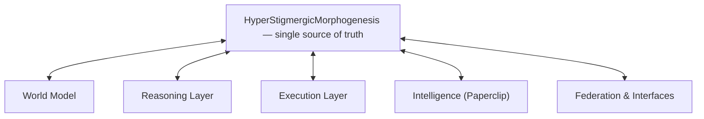

# HSM-II Unified Architecture Blueprint

One organism. One world model (HyperStigmergicMorphogenesis). Every subsystem — Council, RLM, Paperclip, PersonalAgent, Federation, Tools, CompanyOS — is now a layer or method inside the same living hypergraph.

## Five Living Layers

| Layer | Responsibility | Key Abstraction | Lives Inside | Code Modules |
|-------|----------------|-----------------|--------------|--------------|
| **World Model** | Beliefs, experiences, hypergraph, ontology, social memory, curated skills | `HyperStigmergicMorphogenesis` | Core | `hyper_stigmergy.rs, hypergraph.rs, database.rs, embedded_graph_store.rs, property_graph.rs` |
| **Reasoning Layer** | Council decisions, neural-symbolic braid, Prolog, DSPy, outcome inference | `BraidOrchestrator + Council` | World Model | `consensus.rs, council/, reasoning_braid.rs, prolog_engine.rs, dspy.rs, outcome_inference.rs` |
| **Execution Layer** | Skills, tools, RLM executor, personal agents, skill distillation, dream consolidation | `ToolRegistry + IntegratedExecutor + PersonalAgent` | World Model | `skill.rs, tools/, rlm.rs, rlm_v2.rs, personal/, trace2skill.rs, dream/` |
| **Intelligence Layer (Paperclip)** | Company OS orchestration, goals, DRIs, signals, capabilities, living organization runtime. This is the IN-MEMORY runtime brain (not the durable Postgres store). Can be used standalone or bridged to Company OS. | `IntelligenceLayer` | World Model | `paperclip/, company_os/` |
| **Federation & Interfaces** | Cross-system sync, REST API, web console, gateways, observability | `PropagationEngine + ApiState` | World Model | `federation/, api/mod.rs, console/, gateways/, observability.rs` |

## Data Flows (the only 5 paths that matter)

### Belief → World

User input / API → guardrails → world model update → propagation

1. POST /api/beliefs
2. RateLimiter + WorldGuardrails
3. HyperStigmergicMorphogenesis.add_belief_with_extras()
4. Hypergraph update + provenance
5. PropagationEngine (if federated)

### Signal → Decision → Action

External signal → IntelligenceLayer → Council → RLM/Tool execution → Experience

1. IntelligenceLayer.process_signal()
2. Council (Simple / Debate / Ralph / Orchestrator)
3. RLM.bid_and_execute() or ToolRegistry
4. Store Experience + Dream consolidation

### Trajectory → Skill → Dream

Operator actions → trace2skill → DSPy → SkillBank → StigmergicDreamEngine

1. ToolStepRecord[] from interaction
2. trace2skill.trajectory_from_eval_turn()
3. DspyOptimize + Skill creation
4. SkillBank.push()
5. Offline Dream → CrystallizedPattern

### Federation Sync

Local belief → provenance → propagation → remote merge

1. Local Belief Created
2. Provenance + EdgeScope
3. PropagationEngine + StateSyncEngine
4. VectorClock + ConflictMediator
5. Remote merge + trust update

### Personal / Company Loop

PersonalAgent or CompanyOS directly reads/writes the shared world model

1. PersonalAgent.heartbeat() or CompanyOS task
2. Direct access to HyperStigmergicMorphogenesis
3. Memory / Goal / DRI updates
4. Tool execution + feedback to Dream

## Dual Company Architecture

**Two distinct company layers (deliberately separate):**

1. **Company OS (PostgreSQL)** — multi-tenant workspace
   This is the Paperclip-class control plane: companies, goals, tasks, workforce agents, skills, spend, onboarding, etc. It lives in src/company_os/ and is optional.
   Turned on with HSM_COMPANY_OS_DATABASE_URL pointing at Postgres; migrations run on startup.
   HTTP surface (via the console server): routes like /api/company/companies, /api/company/companies/:id/tasks, etc.
   If Postgres isn't configured → clear "not configured" error.

2. **Paperclip IntelligenceLayer (in-process)** — runtime intelligence
   Lives inside HyperStigmergicMorphogenesis as in-memory state (goals, DRIs, capabilities, signals).
   Exposed as /api/paperclip/*.
   Can be seeded from a template but is not automatically one row per Postgres company unless you wire it.

**How they relate to the world model**
Beliefs / hypergraph = shared stigmergic memory.
Company OS = orthogonal relational model for ops.
They can be bridged (e.g. task context pulls from Postgres) but are not merged unless you explicitly connect them.

**Company selection in the console**
Users select a Postgres company ID → all scoped APIs and UI panels are filtered to that workspace. The raw world model remains separate unless bridged.
## Entry Points (binaries)

- `agentd.rs`
- `conductord.rs`
- `hsm_api.rs`
- `personal_agent.rs`
- `teamd.rs`
- `integrated_agent.rs`
- `hsm_outer_loop.rs`
- `hsm_console.rs`
- `hsm_cc_orchestrate.rs`
- `hypergraphd.rs`
- `hsm_business_pack.rs`
- `hsm_gepa.rs`

## Shared Abstractions (single source of truth)

- `HyperStigmergicMorphogenesis`
- `Hypergraph`
- `SkillBank`
- `IntelligenceLayer`
- `ToolRegistry`
- `Council`
- `RLM`
- `PropagationEngine`
- `PersonalAgent`
- `BraidOrchestrator`

## System Overview (Mermaid)

