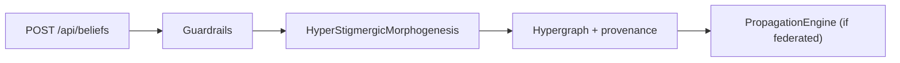
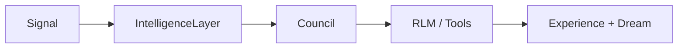
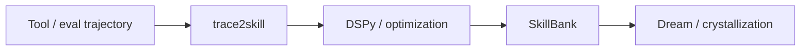
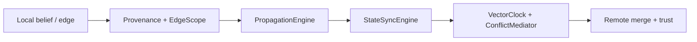
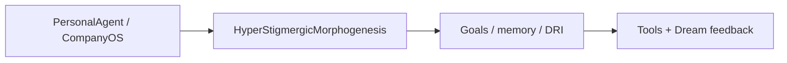
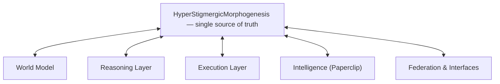

# HSM-II architecture (unified blueprint)

The **machine source of truth** is [`architecture/hsm-ii-blueprint.ron`](architecture/hsm-ii-blueprint.ron): layers, data flows, entry points, and shared abstractions. It is embedded in the Rust crate and served at runtime.

The **full generated Markdown** (exactly what `blueprint_markdown()` emits—tables, data flows, dual company section, Mermaid) is checked in as [`ARCHITECTURE.generated.md`](ARCHITECTURE.generated.md). It must stay in sync with the RON: `cargo test --lib` compares this file to live output. After editing the blueprint, run `./scripts/generate-architecture-md.sh` from the repo root and commit the updated file.

## Regenerate the narrative report

From the repo root (must `cd` into the crate that contains `Cargo.toml`):

```bash
cargo run -q --bin hsm_archviz -- markdown
```

JSON (same shape as the `blueprint` field from `GET /api/architecture`, without `runtime`):

```bash
cargo run -q --bin hsm_archviz -- json
cargo run -q --bin hsm_archviz -- json | jq .
```

With a bootstrapped **embedded graph store**, add live stats (same idea as `GET /api/architecture`):

```bash
cargo run -q --bin hsm_archviz -- markdown --live
cargo run -q --bin hsm_archviz -- json --live | jq .
```

Persistence uses **stderr** for lines like `System state loaded from world_state.ladybug.bincode`, so **stdout stays pure JSON** for `jq`.

`-q` keeps Cargo from printing “Compiling…” / “Finished…” between you and your pipe. After a build, you can call the binary directly:

```bash
./target/debug/hsm_archviz json | jq .
```

## Live API and console

When the API is running (for example via `personal_agent` or `hsm-api`):

- **GET** `/api/architecture` — JSON: `{ "blueprint": { ... }, "runtime": { ... } | null }`.  
  `runtime` is present when a `HyperStigmergicMorphogenesis` instance is mounted on `ApiState`.

In the company console workspace, open **Architecture** (or **Graph**) to explore structure alongside hypergraph data; the blueprint describes *how* subsystems relate, not task-level edges.

## Five living layers (summary)

| Layer | Role |
|-------|------|
| **World Model** | Beliefs, experiences, hypergraph, ontology, social memory, skills |
| **Reasoning** | Council, braid, Prolog, DSPy, outcome inference |
| **Execution** | Tools, RLM, personal agents, trace2skill, dream consolidation |
| **Intelligence (Paperclip)** | Company OS, goals, DRIs, signals |
| **Federation & interfaces** | Sync, REST API, console, gateways, observability |

## Five data flows (Mermaid)

These match the `data_flows` entries in the RON file.

### 1. Belief → World



### 2. Signal → Decision → Action



### 3. Trajectory → Skill → Dream



### 4. Federation sync



### 5. Personal / company loop



## System overview (single source of truth)

Same hub-and-spoke diagram appended by `blueprint_markdown` / `cargo run -q --bin hsm_archviz`.



## Code hooks

- **Module:** `architecture_blueprint` — `embedded_blueprint()`, `blueprint_markdown()`, `blueprint_markdown_with_runtime()`, `load_blueprint_from_path()`.
- **World:** `HyperStigmergicMorphogenesis::architecture_blueprint()`, `architecture_runtime_snapshot()`, `architecture_stats()` (alias).

## Deeper historical docs

Older deep-dives remain under [`documentation/architecture/`](documentation/architecture/) for narrative history; **operational truth** for the unified five-layer model is the RON file above plus the generated Markdown from `hsm_archviz`.
