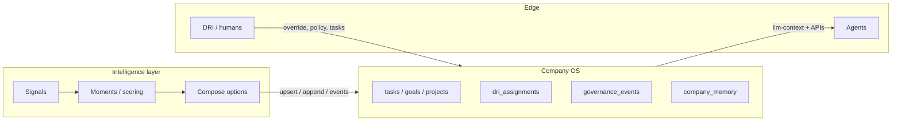

# Intelligence layer, DRIs, and Company OS — alignment (Block-style “future company”)

This document is the **implementation-facing** companion to the product thesis: *machine-speed coordination, humans at the edge as DRIs and player-coaches, no middle layer whose job is routing.* It maps that mentality onto **this repo’s** Postgres Company OS so integrators do not split state across a second “brain.”

**One line:** *The intelligence layer is the composer; Company OS is the constitution and ledger; DRIs are the circuit breakers and outcome owners at the edge.*

---

## 1. Three layers — do not collapse them

| Layer | Role | In this codebase |
|-------|------|------------------|
| **Intelligence** | Ingests signals, scores moments, proposes routings, composes options. May live outside this repo. | Optional: Paperclip-style `/api/paperclip/*` experiments; future: webhooks/jobs calling Company OS APIs. |
| **Company OS** | **Canonical** operational truth per `company_id`. | Postgres: tasks, goals, projects, `dri_assignments`, memory, spend, governance, `llm-context` assembly. |
| **People** | DRIs own outcomes; player-coaches ship and mentor; both **override** when ethics, stakes, or uncertainty demand it. | `dri_assignments` rows; `requires_human`; policy `decision_mode`; task ownership / checkout; stigmergic notes and agent-run feedback. |

**Rule:** intelligence **proposes**; **Postgres + humans dispose**. Anything that looks like “company state” (goals, who owns what, what work exists) must **land in** Company OS or be **synced into** it — see [world-model-and-intelligence.md](./world-model-and-intelligence.md) §3.

---

## 2. Mapping: thesis → concrete hooks

| Idea | Practical hook |
|------|------------------|
| DRI as outcome owner | `dri_assignments` (`dri_key`, `agent_ref`, domains, tenure); sync via `POST …/sync/paperclip-dris` or manual CRUD under `…/dri-assignments`. |
| Work as a graph | `tasks`, `goals`, `projects`, `capability_refs`, `parent_task_id`, dependencies as implemented. |
| “Nervous system” trace | `governance_events` + `GET …/intelligence/summary` workflow feed. |
| Universal context to the edge | `companies.context_markdown`, `company_memory_entries` (shared / broadcast), `GET …/tasks/:id/llm-context`. |
| Model humility / escalation | `requires_human`, policy outcomes on tasks, stigmergic `context_notes`, `agent_runs` + `run_feedback_events` + promote-to-task. |
| Direction vs procedure | `visions.md` at pack root + [playbooks-projects-and-visions.md](./playbooks-projects-and-visions.md); company narrative in `context_markdown`. |
| Failure → capability backlog | Tasks / goals whose `specification` records **missing capability** + signal link — primary input when composition fails. |

---

## 3. Operating principles

### 3.1 DRI-first routing

- Cross-cutting outcomes should resolve to a **DRI row** when possible: link work to **`dri_key`** or **`goal_id`** in task/spec copy and capability refs.
- Prefer **governance events** and the intelligence **workflow feed** for auditable “why this was raised” rather than chat-only routing.

### 3.2 Failure → backlog (real roadmap)

- When the intelligence layer **cannot** compose a solution, represent it as a **task** or **goal** with an explicit **gap statement** (what primitive is missing, what signal triggered it). That row becomes the **data-backed** backlog signal.

### 3.3 Model humility

- Low confidence → **escalate**: set **`requires_human`**, use **`decision_mode`** / policy paths, or assign to a **DRI-owned** task. Do not silently auto-commit high-stakes actions without a row in Company OS.

### 3.4 Direction compounding

- **`visions.md`** + **`context_markdown`** + **shared memory** hold **approved** direction. Intelligence should **diff** new signals against that; operators resolve conflicts by **editing vision/context/memory**, not by hiding state in a side channel.

---

## 4. Integration checklist (when wiring an external intelligence service)

1. **Inbound**
   - Upsert **goals** / **tasks** via existing APIs; include `company_id` and stable external ids where applicable (`paperclip_goal_id`, etc.).
   - Append **`governance_events`** with typed `action` values (e.g. `intelligence_moment_detected`, `dri_escalation_suggested`) and JSON `payload` for traceability.
   - Optional: sync **DRIs** via `POST …/sync/paperclip-dris` or direct `dri_assignments` CRUD.

2. **Outbound**
   - Agents and tooling consume **`GET …/tasks/{task_id}/llm-context`** and **`company_memory_search`** — no second “company brain” database without sync.

3. **Metrics**
   - Tie **spend_events** and task outcomes to **`goal_id` / `project_id` / DRI** where possible so “compounding understanding” is measurable in one store.

4. **Anti-patterns**
   - Parallel task lists or goal trees only in the intelligence service.
   - UIs that imply authority without a **`company_id`** and API path.

---

## 5. Related docs

- [Company world model and intelligence](./world-model-and-intelligence.md) — canonical graph vs optional Paperclip layer.  
- [Playbooks, projects, and visions](./playbooks-projects-and-visions.md) — `visions.md` vs SOPs.  
- [Memory, workspace, shared context](../issues/memory-workspace-shared-context.md) — memory scopes and `llm-context`.
