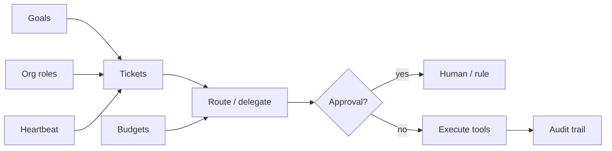

# Enterprise ops plane — goals, org, budgets, tickets, governance

This document defines an **operational model** for running multiple specialist agents under audit and policy: *who works on what, under what budget, with what approvals, on whose behalf*. It maps each concept to pieces that already exist in HSM-II and calls out gaps to implement next.

## 1. Canonical objects

| Concept | Meaning | Persistent home (by default) |
|--------|---------|------------------------------|
| **Company** | Isolated tenant: brand, team, campaigns, files | One directory per `tenant_id` (see `TeamOrchestrator` + `tenant` registry) — **not** the same as `HSMII_HOME` unless you choose that layout |
| **Goal** | Outcome the org optimizes for (OKR-style), time-bounded | Suggested: `config/operations.yaml` + optional CRM/external system of record |
| **Org chart** | Roles, reporting lines, tool/policy scopes | `TeamOrchestrator` + `BusinessRole` / `team_members.json` under tenant home |
| **Budget** | Caps on spend (LLM, APIs, ads) per company / role / period | **Gap:** central ledger; today use external billing + env limits per process |
| **Ticket** | Unit of work: title, owner role, state, links | Suggested: `operations/tickets/*.json` or external issue tracker; **partial:** campaigns/tasks in autonomous team layer |
| **Delegation** | Handoff to another process (Hermes, sub-agent) with id + logs | `hsm_a2a_adapter` `delegate_task`, `delegations/` artifacts |
| **Approval** | Human or rule gate before sensitive tools | `harness` `ApprovalStore` (`approvals.json`), `/approve` flow |
| **Heartbeat** | Scheduled tick: review queue, nudge stale tickets, sync | `HEARTBEAT.md` + `Heartbeat::tick`, `HSM_HEARTBEAT_INTERVAL_SECS` on enhanced agent |
| **Governance** | Policy bundles: what may run, who can approve, retention | Combine tool firewall (`HSM_TOOL_ALLOW` / block prefixes), approvals, Ouroboros gate (coder path) |
| **Audit trail** | Append-only record of turns, denials, relations | `memory/task_trail.jsonl` (`TaskTrail`), webhook `HSM_OUTBOUND_WEBHOOK_URL` |

## 2. Multi-company isolation

- **Tenant / team layer:** `TenantRegistry` holds an LRU of `TeamOrchestrator` instances; each tenant’s state is **file-based under its own directory** (`team_members.json`, brand, campaigns, dream advisor). Use **distinct roots per customer** so paths never overlap.
- **Personal agent layer:** `HSMII_HOME` is usually *one* operator profile. For strict isolation, run **separate processes** (or profiles) per company, each with its own `HSMII_HOME` and business pack.
- **Rule of thumb:** *Company data and budgets live in the tenant/ops store; operator habits live in `HSMII_HOME`.*

## 3. Flow (high level)

## 4. What is already in the repo

- **Org + routing:** `TeamOrchestrator` — members by `BusinessRole`, `route_task`, `system_prompt_for`, persisted `team_members.json`.
- **Multi-tenant teams:** `tenant.rs` + `team_api.rs` — load/save orchestrator per `tenant_id`.
- **Delegation:** `src/bin/hsm_a2a_adapter.rs` — structured `delegate_task`, stdout/stderr and JSON result under `state_dir/delegations/`.
- **Approvals:** `src/harness/approval.rs` — durable rules + pending queue.
- **Heartbeat:** `src/personal/heartbeat.rs` — checklist, cron-style jobs, routines; integrated with `EnhancedPersonalAgent` heartbeat tick.
- **Audit:** `src/personal/task_trail.rs` — JSONL turn/tool/denial events.

## 5. Gaps (recommended next steps)

1. **Single `operations.yaml` (or DB)** loaded at startup: goals, budgets, ticket schema, heartbeat hooks that *read/write* tickets (today heartbeat tasks are mostly descriptive unless you wire tools).
2. **Cost caps:** aggregate LLM/API usage per `tenant_id` or per role; enforce before model calls (middleware in `llm/client` or personal agent).
3. **Ticket CRUD tools** scoped by tenant + role, emitting events to `task_trail.jsonl` and optional webhook.
4. **Governance bundles:** named profiles (e.g. `sales_outbound`, `finance`) mapping to `HSM_TOOL_ALLOW` + approval keys + max daily spend.

## 6. Example on-disk layout

See `templates/hsmii/operations.example.yaml` for a copy-paste schema. Install as `<HSMII_HOME>/config/operations.yaml` or set `HSM_OPERATIONS_YAML`. The enhanced personal agent exposes **`read_operations`** and **`list_tickets`** tools (loader + validation in `src/personal/ops_config.rs`).

## 7. Related docs

- `documentation/guides/COMPANY_OS_ROADMAP.md` — Postgres-backed Company OS (Paperclip-class UI/portfolio/budgets) phased plan + `documentation/schemas/company_os_v1.sql`.
- `documentation/guides/HARNESS_V1_PLAN.md` — control plane, approvals, plugins.
- `documentation/guides/A2A_MESSAGE_CONTRACTS.md` — delegation / JSON-RPC sidecar.
- `documentation/guides/BUSINESS_PACK.md` — per-company *persona* and knowledge, not full ops state.
